# Software Design Document — AI Executive Email Assistant (AEEA)

**Status:** Draft v1.0 · **Classification:** Internal Engineering
**Owner:** Lead Software Architect · **Audience:** Backend, Frontend, ML, SRE, Security
**Scope:** Design-only. No implementation code. Every decision below is intended to be directly buildable by the respective team.

---

## 0. Document Conventions & Reading Guide

- **MUST / SHOULD / MAY** follow RFC 2119.
- Diagrams are authored in Mermaid so they render in GitHub, GitLab, and most Markdown viewers.
- "Executive" = the primary human user whose mailbox is being managed. "Operator" = internal admin.
- The system is designed **multi-tenant from day one** even though the MVP onboards a single executive; this avoids a costly re-architecture later (see §14).
- Design principle hierarchy when trade-offs collide: **Security & privacy → Correctness → Reversibility (human-in-the-loop) → Latency → Cost.**

---

## 1. Functional Requirements

### 1.1 Core capabilities (MVP)

| ID | Requirement |
|----|-------------|
| FR-1 | The system MUST allow an executive to connect their Google account via OAuth 2.0 and grant Gmail scopes. |
| FR-2 | The system MUST ingest incoming email in near-real-time (Gmail push via Pub/Sub) with a scheduled polling fallback. |
| FR-3 | The system MUST classify every ingested email into a taxonomy (e.g., `action_required`, `fyi`, `meeting`, `newsletter`, `spam_like`, `personal`, `escalation`). |
| FR-4 | The system MUST prioritize emails into an executive-facing queue (P0–P3) using sender importance, thread history, and content signals. |
| FR-5 | The system MUST generate summaries for long threads (single-email and rolled-up thread summaries). |
| FR-6 | The system MUST draft context-aware replies in the executive's voice, never auto-sending without approval by default. |
| FR-7 | The executive MUST be able to approve, edit, regenerate, or reject any AI draft from the web UI. |
| FR-8 | The system MUST support "send on approval" and an opt-in **auto-send** mode restricted to low-risk categories with guardrails. |
| FR-9 | The system MUST extract action items, deadlines, and meeting requests and surface them as tasks. |
| FR-10 | The system MUST schedule follow-up reminders ("nudge me if no reply in 3 days") via the scheduler. |
| FR-11 | The system MUST learn and persist executive preferences (tone, signature, VIP contacts, do-not-auto-reply rules) as long-term memory. |
| FR-12 | The system MUST expose an audit trail of every AI action (what was read, decided, drafted, sent, and why). |
| FR-13 | The executive MUST be able to pause/resume the assistant globally or per-thread. |

### 1.2 Secondary capabilities (post-MVP, designed-for)

| ID | Requirement |
|----|-------------|
| FR-14 | Multi-mailbox / delegate support (executive + chief of staff). |
| FR-15 | Calendar-aware scheduling proposals (read/write Google Calendar). |
| FR-16 | Multi-language detection and reply-in-same-language. |
| FR-17 | Bulk actions (archive all newsletters, snooze category). |
| FR-18 | Slack/Teams digest delivery of the daily brief. |

### 1.3 Explicit non-goals (v1)

- Not a full email client replacement (no folder management UI parity with Gmail).
- No autonomous financial/contractual commitments on the executive's behalf.
- No training of foundation models on user data (only prompt-time context + lightweight memory).

---

## 2. Non-Functional Requirements

| Category | Requirement | Target |
|----------|-------------|--------|
| **Latency** | Classification + priority for a new email | p95 < 6 s from ingest to queue-ready |
| | Draft generation (interactive) | p95 < 12 s; streamed to UI |
| **Throughput** | Sustained ingest per tenant | 500 emails/hour without backlog |
| **Availability** | Backend API | 99.9% monthly |
| | Ingestion pipeline | 99.5% (async, backlog-tolerant) |
| **Durability** | No email/decision loss | RPO ≤ 5 min, RTO ≤ 30 min |
| **Consistency** | Draft/approval state | Strongly consistent (single source of truth in Postgres) |
| **Security** | Data at rest | AES-256; token/PII column encryption |
| | Data in transit | TLS 1.2+ everywhere |
| **Privacy** | Email body retention | Configurable; default store metadata + embeddings, purge raw bodies after N days |
| **Scalability** | Tenants | Horizontal to 10k mailboxes without redesign |
| **Cost** | LLM spend | Per-tenant budget caps + token accounting (see §18) |
| **Observability** | Traceability | Every LLM/agent step traced end-to-end |
| **Compliance** | Google API Services User Data Policy (incl. Limited Use); GDPR data-subject rights | Enforced |
| **Maintainability** | Test coverage of core domain | ≥ 85% lines, 100% of critical paths |
| **Portability** | Runtime | Containerized; cloud-agnostic core, GCP-adjacent for Gmail/Pub/Sub |

---

## 3. System Architecture

### 3.1 Architectural style

A **modular monolith backend** with clean internal boundaries (hexagonal / ports-and-adapters), fronted by a **Next.js SPA/SSR** client, backed by **PostgreSQL**, with **asynchronous background processing** driven by APScheduler and a durable job/outbox pattern. LangGraph is the orchestration layer for all agentic reasoning. This is deliberately *not* microservices at launch — the seams are drawn so services can be peeled off later (§14) once load and team size justify the operational cost.

### 3.2 High-level component diagram

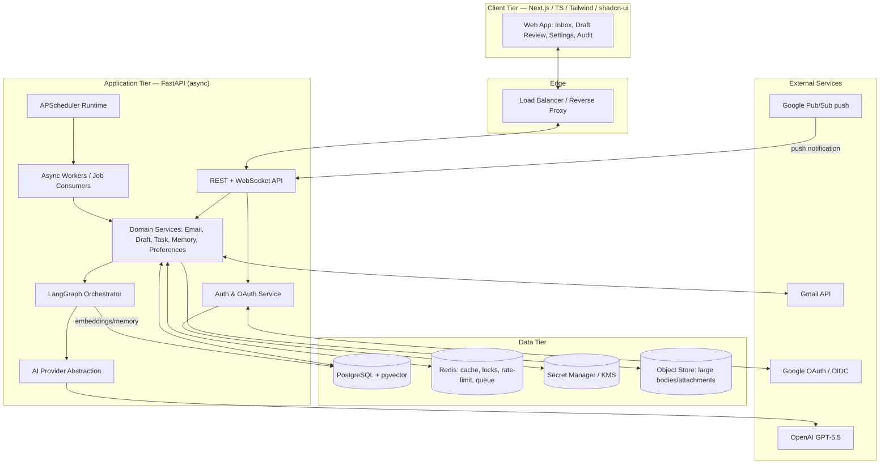

### 3.3 Key architectural decisions (ADR summary)

| ADR | Decision | Rationale | Consequence |
|-----|----------|-----------|-------------|
| ADR-1 | Modular monolith over microservices | Small team, single bounded context, faster iteration | Must enforce module boundaries via linting + import rules |
| ADR-2 | Postgres + `pgvector` for memory | One durable store; transactional consistency between facts and embeddings | Vector search less specialized than a dedicated DB; acceptable at MVP scale |
| ADR-3 | Outbox + idempotent consumers for Gmail actions | Gmail sends are side-effecting and must not double-fire | Extra table + reconciliation logic |
| ADR-4 | Human-in-the-loop by default | Executive trust + liability | Requires approval UX; auto-send is opt-in and guardrailed |
| ADR-5 | LangGraph for orchestration | Explicit stateful graphs, checkpoints, retries, and interrupts (approval gates) | Team must learn LangGraph state model |
| ADR-6 | Provider abstraction over OpenAI | Avoid vendor lock; enable fallback/routing | Slight indirection cost |
| ADR-7 | Redis for locks/rate-limit/cache | Distributed locking + token buckets need a shared fast store | Extra infra component |

---

## 4. Folder Structure

Two deployables in one monorepo: `backend/` and `frontend/`, plus shared infra.

```
aeea/
├── backend/
│   ├── app/
│   │   ├── main.py                      # FastAPI app factory, lifespan, router mounting
│   │   ├── config/
│   │   │   ├── settings.py              # Pydantic Settings (env-driven, typed)
│   │   │   └── logging.py               # structlog/logging config
│   │   ├── api/
│   │   │   ├── deps.py                  # DI providers (db session, current user, services)
│   │   │   ├── middleware/              # auth, request-id, rate-limit, error handlers
│   │   │   └── v1/
│   │   │       ├── routes_auth.py
│   │   │       ├── routes_emails.py
│   │   │       ├── routes_drafts.py
│   │   │       ├── routes_tasks.py
│   │   │       ├── routes_memory.py
│   │   │       ├── routes_settings.py
│   │   │       ├── routes_webhooks.py   # Pub/Sub push endpoint
│   │   │       └── routes_ws.py         # WebSocket: streaming drafts, live updates
│   │   ├── domain/                      # Pure business logic, framework-agnostic
│   │   │   ├── email/                   # entities, classifier policy, prioritizer
│   │   │   ├── draft/                   # draft lifecycle, approval state machine
│   │   │   ├── task/                    # action items, follow-ups
│   │   │   ├── memory/                  # memory model, retrieval policy
│   │   │   ├── preferences/             # executive preferences, VIP rules
│   │   │   └── audit/                   # audit event model
│   │   ├── services/                    # application services (orchestrate domain + adapters)
│   │   │   ├── email_service.py
│   │   │   ├── draft_service.py
│   │   │   ├── task_service.py
│   │   │   ├── memory_service.py
│   │   │   ├── preference_service.py
│   │   │   └── audit_service.py
│   │   ├── orchestration/               # LangGraph
│   │   │   ├── graphs/
│   │   │   │   ├── triage_graph.py
│   │   │   │   ├── draft_graph.py
│   │   │   │   └── digest_graph.py
│   │   │   ├── nodes/                   # individual graph nodes
│   │   │   ├── state.py                 # typed graph state schemas
│   │   │   ├── checkpoints.py           # Postgres checkpointer wiring
│   │   │   └── tools/                   # tool-calling adapters exposed to the agent
│   │   ├── ai/                          # AI provider abstraction
│   │   │   ├── base.py                  # LLMProvider protocol/interface
│   │   │   ├── openai_provider.py
│   │   │   ├── router.py                # model routing / fallback
│   │   │   ├── embeddings.py
│   │   │   └── prompts/                 # versioned prompt templates
│   │   ├── integrations/
│   │   │   ├── gmail/                   # Gmail client, watch mgmt, parsing
│   │   │   ├── google_oauth/            # OAuth flow, token refresh
│   │   │   └── pubsub/                  # push subscription verification
│   │   ├── infra/
│   │   │   ├── db/                      # engine, session, base, unit-of-work
│   │   │   ├── models/                  # SQLAlchemy ORM models
│   │   │   ├── repositories/            # repository interfaces + impls
│   │   │   ├── cache/                   # Redis client, locks
│   │   │   ├── outbox/                  # transactional outbox + dispatcher
│   │   │   ├── ratelimit/               # token-bucket limiters
│   │   │   ├── crypto/                  # column encryption, KMS wrapper
│   │   │   └── scheduler/               # APScheduler setup + job registry
│   │   ├── workers/                     # background job handlers
│   │   └── observability/               # tracing, metrics, audit sinks
│   ├── migrations/                      # Alembic
│   ├── tests/
│   │   ├── unit/
│   │   ├── integration/
│   │   ├── e2e/
│   │   └── fixtures/
│   ├── pyproject.toml                   # deps, Ruff, mypy config
│   └── Dockerfile
│
├── frontend/
│   ├── app/                             # Next.js App Router
│   │   ├── (auth)/                      # login, oauth callback
│   │   ├── (dashboard)/
│   │   │   ├── inbox/
│   │   │   ├── drafts/
│   │   │   ├── tasks/
│   │   │   ├── settings/
│   │   │   └── audit/
│   │   ├── api/                         # route handlers (BFF proxy, session)
│   │   └── layout.tsx
│   ├── components/
│   │   ├── ui/                          # shadcn/ui primitives
│   │   ├── inbox/
│   │   ├── drafts/
│   │   └── shared/
│   ├── lib/
│   │   ├── api-client.ts                # typed fetch client (OpenAPI-generated)
│   │   ├── ws-client.ts                 # WebSocket hooks
│   │   ├── auth.ts                      # session handling
│   │   └── query/                       # TanStack Query hooks
│   ├── types/                           # generated from backend OpenAPI schema
│   ├── styles/
│   ├── package.json
│   └── Dockerfile
│
├── infra/
│   ├── docker-compose.yml               # local dev: api, worker, db, redis, frontend
│   ├── docker-compose.prod.yml
│   ├── k8s/                             # (future) manifests/helm
│   └── terraform/                       # (future) cloud provisioning
│
├── docs/
│   ├── adr/                             # architecture decision records
│   ├── runbooks/
│   └── api/                             # exported OpenAPI
├── Makefile
└── README.md
```

---

## 5. Module Responsibilities

### 5.1 Backend modules

| Module | Responsibility | Depends on | Explicitly NOT responsible for |
|--------|----------------|------------|-------------------------------|
| `api/` | HTTP/WS transport, request validation, auth enforcement, serialization | services, deps | Business rules, persistence details |
| `domain/` | Pure business logic & invariants (state machines, policies) | nothing framework-specific | I/O, DB, network |
| `services/` | Use-case orchestration; transactions; combine domain + adapters | domain, infra, integrations, ai | HTTP concerns |
| `orchestration/` | LangGraph graphs, nodes, checkpointing, human-in-loop interrupts | ai, services (via tools) | Direct DB writes outside tools |
| `ai/` | Provider-agnostic LLM/embedding access, routing, prompt mgmt | none (leaf) | Business decisions |
| `integrations/gmail` | Gmail read/send/watch, MIME parsing, history sync | infra/crypto, oauth | Classification/priority |
| `integrations/google_oauth` | OAuth code exchange, token storage, refresh | crypto, secrets | Gmail semantics |
| `infra/db` + `models` + `repositories` | Persistence, ORM mapping, query encapsulation | SQLAlchemy | Business logic |
| `infra/outbox` | Reliable side-effect dispatch (Gmail sends, notifications) | db, cache | Deciding *what* to send |
| `infra/ratelimit` | Enforce Gmail/OpenAI/API quotas via token buckets | cache | Retriable error handling policy |
| `infra/scheduler` | Register/trigger recurring & one-shot jobs | workers | Long-running compute inline |
| `workers/` | Execute async jobs: ingest, triage, digest, follow-up | services, orchestration | Serving HTTP |
| `observability/` | Structured logs, traces, metrics, audit event emission | all (cross-cutting) | Business decisions |

### 5.2 Frontend modules

| Module | Responsibility |
|--------|----------------|
| `app/(dashboard)/inbox` | Prioritized triaged inbox; category filters; live updates via WS |
| `app/(dashboard)/drafts` | Draft review: streamed generation, edit, regenerate, approve/reject |
| `app/(dashboard)/tasks` | Action items & follow-ups; snooze/complete |
| `app/(dashboard)/settings` | Preferences, VIP list, auto-send guardrails, connect/disconnect Google |
| `app/(dashboard)/audit` | Human-readable audit trail of every AI action |
| `lib/api-client` | Typed calls generated from backend OpenAPI (single source of truth) |
| `lib/ws-client` | Subscriptions for streaming tokens and inbox deltas |
| `components/ui` | shadcn/ui design-system primitives |

---

## 6. Database ER Diagram

`pgvector` used for embeddings. Sensitive columns (tokens, raw bodies) are encrypted at the application layer (§10).

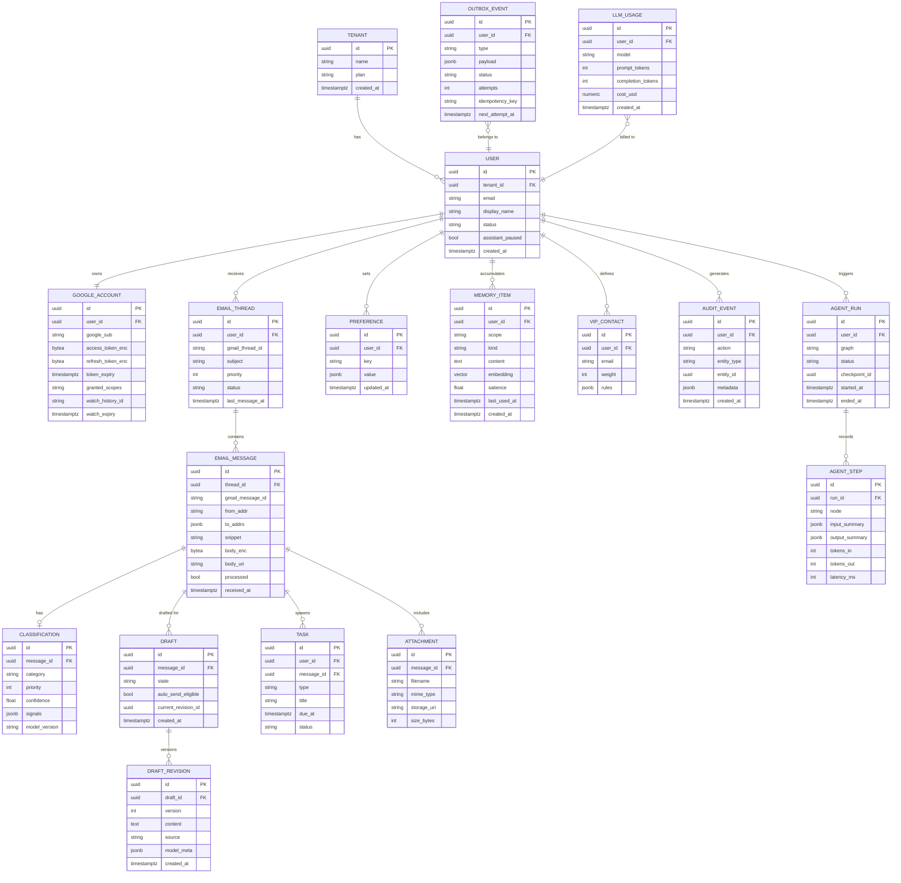

**Indexing notes:** `EMAIL_MESSAGE(gmail_message_id)` unique per user (idempotent ingest); `EMAIL_THREAD(user_id, priority, last_message_at)` for inbox queries; IVFFlat/HNSW index on `MEMORY_ITEM.embedding`; partial index on `OUTBOX_EVENT(status)` where `status='pending'`.

---

## 7. LangGraph Architecture

LangGraph provides the **stateful, checkpointed, interruptible** orchestration. Three graphs; all share a Postgres checkpointer so runs survive restarts and support human-in-the-loop interrupts.

### 7.1 Triage graph (per incoming message)

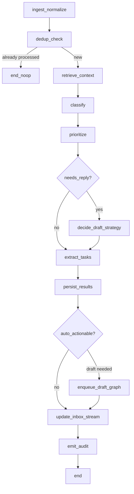

**Node responsibilities**
- `retrieve_context`: pull thread history, VIP status, and top-k memory items (vector search) for the sender/topic.
- `classify` / `prioritize`: LLM + rule hybrid; rules can hard-override the LLM (e.g., legal domain → escalate).
- `decide_draft_strategy`: choose reply template family, tone, and whether auto-send is permitted.
- `persist_results` and `emit_audit` are the only side-effecting nodes and run through repositories/outbox.

### 7.2 Draft graph (reply generation, human-in-the-loop)

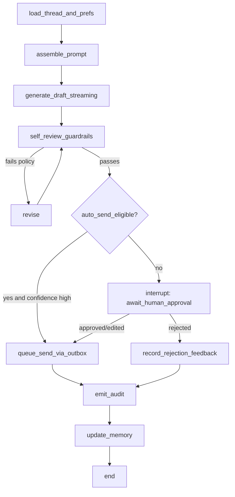

The `interrupt: await_human_approval` node uses LangGraph's interrupt mechanism: the run **pauses and checkpoints**; the API resumes it when the executive approves/edits in the UI. `self_review_guardrails` enforces policy (no commitments, no PII leakage, tone match) before anything is eligible to send.

### 7.3 Digest graph (scheduled daily brief)

`gather_since_last_brief → cluster_by_theme → summarize_clusters → rank_by_priority → compose_brief → deliver(UI/Slack/email) → emit_audit`.

### 7.4 Shared state & checkpointing

- **State schema** (`orchestration/state.py`) is a typed dict: user/tenant IDs, message refs, retrieved context, intermediate classifications, draft text, guardrail verdicts, token accounting, and audit accumulator.
- **Checkpointer:** Postgres-backed. Every node transition persists state → crash-safe, resumable, and auditable via `AGENT_RUN`/`AGENT_STEP`.
- **Tools** exposed to nodes: `gmail_read`, `memory_search`, `memory_write`, `preference_get`, `task_create`, `send_queue`. Tools are the *only* way graphs touch the outside world (keeps nodes pure-ish and testable).
- **Retries & timeouts:** per-node retry policy with exponential backoff; a node that calls the LLM inherits the AI abstraction's fallback/routing.

---

## 8. API Architecture

### 8.1 Style & standards

- REST for CRUD + command endpoints; **WebSocket** for streaming draft tokens and inbox deltas.
- Versioned under `/api/v1`. OpenAPI schema auto-generated by FastAPI → **frontend types generated from it** (contract-first, single source of truth).
- All request/response bodies validated by Pydantic models; errors follow **RFC 9457 Problem Details**.
- Idempotency keys accepted on all mutating command endpoints (esp. send/approve).

### 8.2 Representative endpoints

| Method | Path | Purpose | Auth |
|--------|------|---------|------|
| GET | `/api/v1/auth/google/login` | Begin OAuth (returns Google consent URL + state) | session |
| GET | `/api/v1/auth/google/callback` | OAuth code exchange | state/PKCE |
| POST | `/api/v1/auth/logout` | End session | session |
| GET | `/api/v1/emails` | Paginated triaged inbox (filter by category/priority) | session |
| GET | `/api/v1/emails/{id}` | Message + thread + classification | session |
| POST | `/api/v1/emails/{id}/reclassify` | Force re-triage | session |
| GET | `/api/v1/drafts/{id}` | Draft + revisions | session |
| POST | `/api/v1/drafts/{id}/regenerate` | New revision (streams over WS) | session |
| POST | `/api/v1/drafts/{id}/approve` | Approve (optionally with edited body) → send | session + idempotency |
| POST | `/api/v1/drafts/{id}/reject` | Reject + feedback | session |
| GET | `/api/v1/tasks` / `PATCH /tasks/{id}` | List / update follow-ups | session |
| GET/PUT | `/api/v1/settings/preferences` | Read/update preferences | session |
| GET/POST/DELETE | `/api/v1/settings/vips` | Manage VIP contacts | session |
| GET | `/api/v1/memory` | Inspect learned memory (transparency) | session |
| GET | `/api/v1/audit` | Audit trail | session |
| POST | `/api/v1/webhooks/gmail` | Pub/Sub push receiver | signed JWT (Google) |
| WS | `/api/v1/ws` | Streaming drafts + live inbox updates | session token |

### 8.3 Cross-cutting concerns (middleware order)

`Request-ID → TLS termination (at edge) → CORS → Auth/session → Tenant resolution → Rate limit → Body size guard → Route → Response serialization → Error handler`. Each layer is a thin, independently testable component (DI-injected), consistent with SOLID.

---

## 9. Frontend Architecture

### 9.1 Stack & patterns

- **Next.js App Router** (React Server Components where beneficial; client components for interactive draft review).
- **TypeScript strict mode**; types generated from backend OpenAPI (no hand-written DTO drift).
- **TanStack Query** for server-state (caching, optimistic updates on approve/reject).
- **WebSocket hook** for streamed draft tokens and inbox deltas.
- **Tailwind + shadcn/ui** for the design system; accessible components (Radix underneath).
- **BFF layer:** Next.js route handlers hold the httpOnly session cookie and proxy to FastAPI — the browser never sees Google tokens.

### 9.2 Screen map

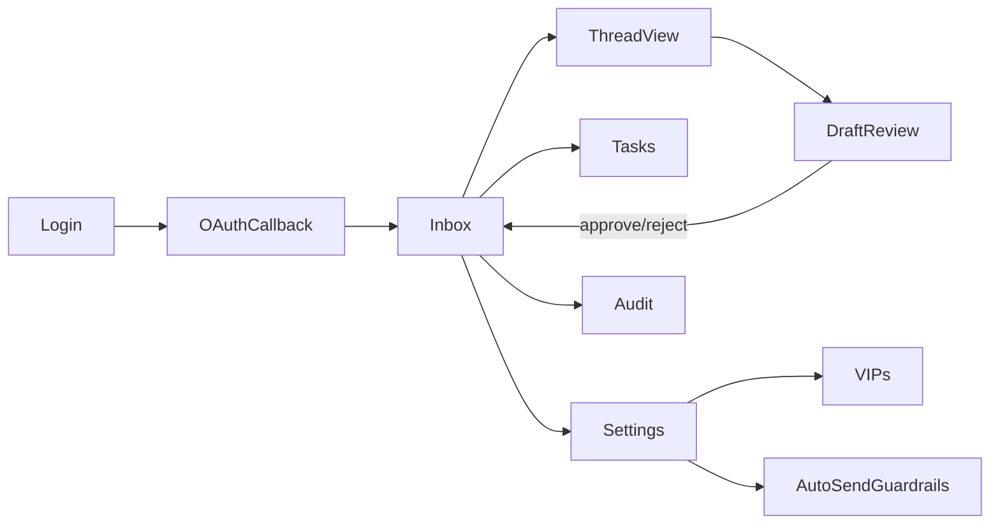

### 9.3 State model

- **Server state:** emails, drafts, tasks (TanStack Query, keyed by user+filters).
- **Realtime state:** WS events reconcile into the query cache (draft token stream, "new email triaged").
- **Local UI state:** draft editor buffer, modal/dialog state (React state/Zustand for ephemeral cross-component UI).
- **Optimistic UX:** approving a draft immediately moves the thread to "sent (pending)" and reconciles when the outbox confirms.

### 9.4 Performance & UX

- Streamed drafts render token-by-token; skeletons for triage-in-progress.
- Route-level code splitting; inbox virtualized list for large mailboxes.
- All destructive actions (reject, disconnect Google, purge memory) require confirmation.

---

## 10. Security Architecture

### 10.1 Threat model (STRIDE-oriented, abbreviated)

| Threat | Mitigation |
|--------|-----------|
| **Spoofing** of Pub/Sub push | Verify Google-signed OIDC JWT on webhook; check audience & issuer |
| **Tampering** with drafts/sends | Idempotency keys, server-side authorization on every mutation, audit log |
| **Repudiation** | Immutable append-only `AUDIT_EVENT`; agent run/step ledger |
| **Information disclosure** (email PII, tokens) | Column-level encryption via KMS; tokens never leave backend; minimize LLM context |
| **Denial of service** | Rate limits, body-size caps, per-tenant quotas, backpressure on ingest |
| **Elevation of privilege** | Least-privilege OAuth scopes; tenant isolation; RBAC (executive vs delegate vs operator) |

### 10.2 Data protection

- **In transit:** TLS 1.2+ everywhere, HSTS at edge.
- **At rest:** DB volume encryption **plus** application-layer AES-256-GCM on OAuth tokens and raw bodies; data keys wrapped by a KMS master key (envelope encryption). Keys rotate on schedule.
- **Secrets:** Never in env files in prod; pulled from Secret Manager at boot; no secrets in logs (redaction filter).
- **PII minimization for LLM:** only the minimum thread context needed is sent; optional PII scrubbing pass; raw bodies purged after retention window (embeddings/summaries retained).

### 10.3 Google-specific compliance

- Request **incremental, minimal scopes** (`gmail.readonly` first; `gmail.send`/`gmail.modify` only when a feature needs them).
- Comply with Google API Services User Data Policy including **Limited Use** — no selling data, no ads, no unrelated use, human review only with explicit consent.
- Clear consent screen; easy disconnect that revokes tokens and offers data deletion.

### 10.4 Application security hygiene

- Input validation via Pydantic; output encoding on the frontend.
- CSRF protection on cookie-based flows; SameSite=strict/lax + double-submit where relevant.
- Dependency scanning (SCA), SAST in CI, container image scanning.
- Guardrails against prompt injection from email content: treat email body as **untrusted data**, never as instructions; tool-use is allow-listed; the agent cannot execute arbitrary sends without passing guardrails + (unless auto-send-eligible) human approval.

---

## 11. Authentication Flow

Two distinct concerns: **(a)** user session auth to the app, **(b)** Google OAuth for Gmail access.

```mermaid
sequenceDiagram
    autonumber
    participant B as Browser
    participant F as Next.js BFF
    participant API as FastAPI
    participant G as Google OAuth
    participant KMS as KMS/Secret Mgr
    participant DB as Postgres

    B->>F: Click "Connect Google"
    F->>API: GET /auth/google/login
    API->>API: Generate state + PKCE verifier, store server-side
    API-->>F: Consent URL (state, code_challenge, minimal scopes)
    F-->>B: Redirect to Google
    B->>G: Authenticate + consent
    G-->>B: Redirect with auth code + state
    B->>F: /oauth/callback?code&state
    F->>API: GET /auth/google/callback (code, state)
    API->>API: Validate state + PKCE verifier
    API->>G: Exchange code (+ verifier) for tokens
    G-->>API: access_token, refresh_token, id_token
    API->>KMS: Encrypt tokens (envelope)
    API->>DB: Store GOOGLE_ACCOUNT (encrypted), create/link USER
    API->>API: Establish app session (httpOnly cookie via BFF)
    API-->>F: Set session; trigger Gmail watch registration
    F-->>B: Redirect to Inbox (authenticated)
```

**Token lifecycle**
- Access tokens refreshed proactively before expiry by a scheduled job; refresh failures flag the account as `reauth_required` and surface a re-connect prompt.
- Revocation on disconnect: call Google revoke endpoint, delete encrypted tokens, optionally purge data.
- App session: short-lived JWT/opaque session in httpOnly cookie; sliding expiration; server-side session store in Redis for instant revocation.

---

## 12. Email Processing Lifecycle

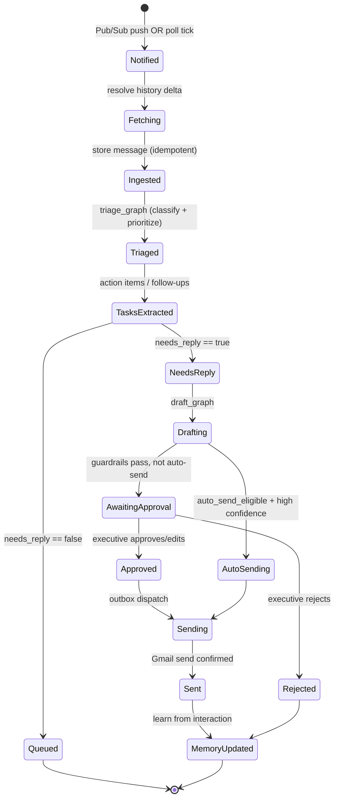

**Guarantees**
- **Idempotent ingest:** `gmail_message_id` uniqueness + dedup node prevents double-processing on redelivered push.
- **Exactly-once send (effectively):** outbox + idempotency key + Gmail message-id reconciliation prevents duplicate sends after retries/crashes.
- **Backpressure:** if triage is backlogged, ingest still persists raw messages; triage catches up via the worker queue.

---

## 13. Sequence Diagrams

### 13.1 Real-time ingest → triage

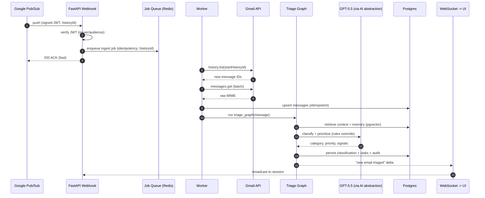

### 13.2 Interactive draft with human approval

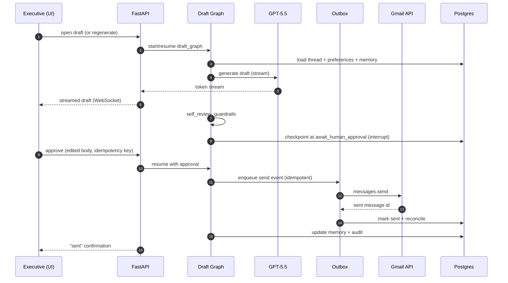

### 13.3 Scheduled follow-up nudge

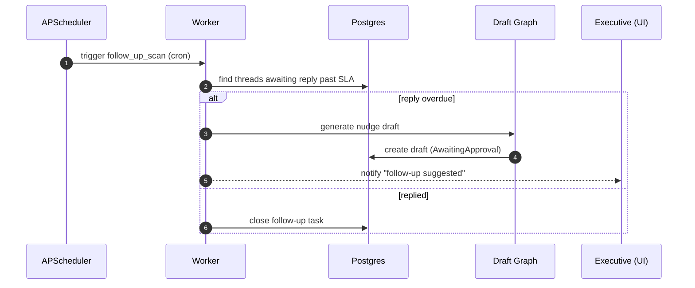

---

## 14. Future Scalability Plan

**Stage 0 (MVP):** single-region modular monolith; API + worker + scheduler as separate processes sharing the codebase; Postgres primary; Redis; one executive → designed multi-tenant.

**Stage 1 (10s of tenants):**
- Split **API**, **worker pool**, and **scheduler** into independently scaled deployments (already separate processes → trivial).
- Postgres read replicas for inbox/read-heavy queries; connection pooling (PgBouncer).
- Move raw bodies/attachments fully to object storage; keep only metadata + embeddings hot.

**Stage 2 (100s–1000s tenants):**
- Replace in-process job queue with a durable broker (e.g., managed queue/Kafka) and autoscaling consumers.
- Extract high-load bounded contexts into services along existing module seams: **Ingestion service**, **Orchestration/LLM service**, **Notification service**. Contracts already exist (repositories/tools), so extraction is mechanical.
- Shard/partition Postgres by tenant; or route large tenants to dedicated DBs.
- Dedicated vector store (e.g., a specialized ANN service) if `pgvector` becomes the bottleneck.

**Stage 3 (10k+ mailboxes / enterprise):**
- Multi-region active-active for API; regional data residency for compliance.
- Per-tenant LLM budget isolation and model routing tiers; caching of embeddings and common summaries.
- Cell-based architecture: tenants grouped into isolated "cells" to bound blast radius.

**Scaling levers, ranked:** (1) horizontal workers for ingest/triage, (2) LLM cost controls & caching, (3) DB read replicas + partitioning, (4) service extraction. Ingestion and LLM calls are the two axes that saturate first — both are already asynchronous and independently scalable by design.

---

## 15. Deployment Architecture

### 15.1 Runtime topology

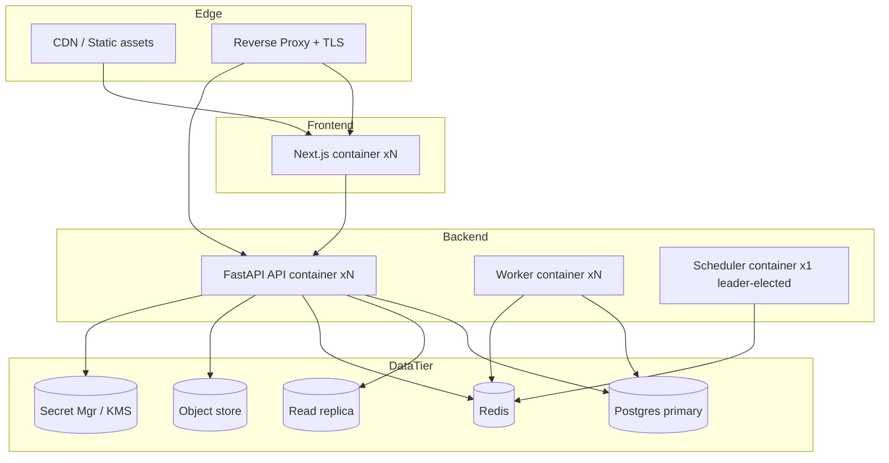

### 15.2 Containerization & environments

- **Docker** images: `frontend`, `api`, `worker`, `scheduler` (shared backend base image; different entrypoints). Multi-stage builds; non-root user; minimal base.
- **Local dev:** `docker-compose` brings up api, worker, scheduler, postgres (+pgvector), redis, frontend, plus a Gmail/Pub-Sub emulator or a dev tunnel for push.
- **Envs:** `dev → staging → prod`, config purely via env + secret manager (12-factor).
- **CI/CD:** lint (Ruff) + type-check (mypy) + tests + image scan → build → push → migrate (Alembic, gated) → rolling deploy. Migrations run as a pre-deploy job; backward-compatible (expand/contract) migrations to allow zero-downtime.
- **Scheduler singleton:** APScheduler runs as a single leader (leader election / advisory lock in Postgres or Redis) to avoid duplicate cron firings; workers are stateless and scale freely.
- **Health:** liveness/readiness probes; graceful shutdown drains in-flight jobs and WS connections.
- **Future:** `k8s/` + Helm and `terraform/` are stubbed in the repo for the Stage-1+ migration; nothing in the app assumes a specific orchestrator.

---

## 16. Logging Strategy

- **Structured JSON logs** (structlog or stdlib + JSON formatter) with a mandatory context: `request_id`, `tenant_id`, `user_id`, `agent_run_id`, `node`, `latency_ms`.
- **Correlation:** one `request_id` (or `run_id` for async) threads through API → worker → graph nodes → LLM calls, enabling full trace reconstruction.
- **Levels:** `DEBUG` (dev only), `INFO` (lifecycle/business events), `WARNING` (recoverable), `ERROR` (failed op with context), `CRITICAL` (data-integrity/security). No sensitive payloads at any level.
- **Three log planes:**
  1. **App/operational logs** → central log aggregator (searchable, retained per policy).
  2. **Audit log** (`AUDIT_EVENT`) → append-only in Postgres, *user-visible*, immutable, business-meaningful ("Draft approved and sent to X").
  3. **LLM/agent trace** (`AGENT_RUN`/`AGENT_STEP` + tracing backend) → prompt/response summaries, token counts, latencies for debugging and cost analysis.
- **Redaction:** a logging filter strips tokens, full email bodies, and PII patterns before emission; only hashes/last-4 where identifiers are needed.
- **Metrics** (separate from logs): ingest lag, triage p95, draft latency, LLM tokens/cost per tenant, outbox backlog, error rates — exported for dashboards and alerts.

---

## 17. Error Handling Strategy

### 17.1 Classification

| Class | Examples | Handling |
|-------|----------|----------|
| **Transient/retryable** | Gmail/OpenAI 429/5xx, network blips | Exponential backoff + jitter, bounded retries (in worker/outbox), then DLQ |
| **Rate-limited** | Quota exceeded | Backoff honoring `Retry-After`; per-tenant token bucket prevents most (§18) |
| **Auth/expired** | Refresh failure, revoked consent | Mark account `reauth_required`; surface re-connect; stop pulling |
| **Validation/business** | Invalid input, illegal state transition | 4xx Problem Details; no retry; user-actionable message |
| **LLM quality/guardrail** | Policy violation, low-confidence, empty draft | Route to `revise` node or force human review; never silently send |
| **Fatal/internal** | Bug, invariant violation | 500 with `request_id`; alert; fail closed (never auto-send on uncertainty) |

### 17.2 Principles

- **Fail closed on side effects:** if anything about a send is uncertain, it degrades to *await human approval* rather than sending.
- **Idempotency everywhere** side-effecting: safe to retry ingest, triage, and send.
- **Dead-letter queue** for jobs that exhaust retries, with a replay tool and operator alert.
- **Circuit breakers** around Gmail and OpenAI: when a provider is degraded, trip the breaker, queue work, and drain when healthy — the UI shows "assistant catching up" rather than erroring.
- **Uniform API errors:** centralized exception handler maps domain exceptions → RFC 9457 Problem Details with `request_id` for support.
- **Graph-level compensation:** LangGraph checkpoints allow a failed run to resume from the last good node rather than restart, avoiding duplicate LLM spend and partial side effects.

---

## 18. Rate Limiting Strategy

Three surfaces to protect: **inbound API**, **Gmail API quotas**, **OpenAI quotas + cost**.

| Surface | Mechanism |
|---------|-----------|
| **Inbound API** | Per-user + per-IP **token bucket** in Redis; stricter limits on expensive endpoints (`regenerate`, `reclassify`). Global tenant ceiling to prevent noisy-neighbor. Returns 429 + `Retry-After`. |
| **Gmail API** | Respect per-user rate limits & daily quota; a distributed token bucket keyed by `google_account_id` shapes outbound calls; batch `messages.get`; adaptive backoff on 429. `watch` renewals scheduled before 7-day expiry. |
| **OpenAI GPT-5.5** | Per-tenant **request + token budget** buckets; concurrency cap; queue overflow rather than hammering; `Retry-After`-aware backoff. **Cost caps**: monthly per-tenant USD ceiling; when approached, degrade to cheaper model tier / summaries-only and alert. |

**Supporting tactics:** debounce rapid re-triage; cache embeddings and thread summaries to avoid recomputation; deduplicate concurrent draft requests for the same message via a Redis lock; prioritize P0 traffic when throttled (priority queue).

---

## 19. AI Provider Abstraction

Goal: business logic and LangGraph nodes **never import OpenAI directly**. They depend on a stable internal interface.

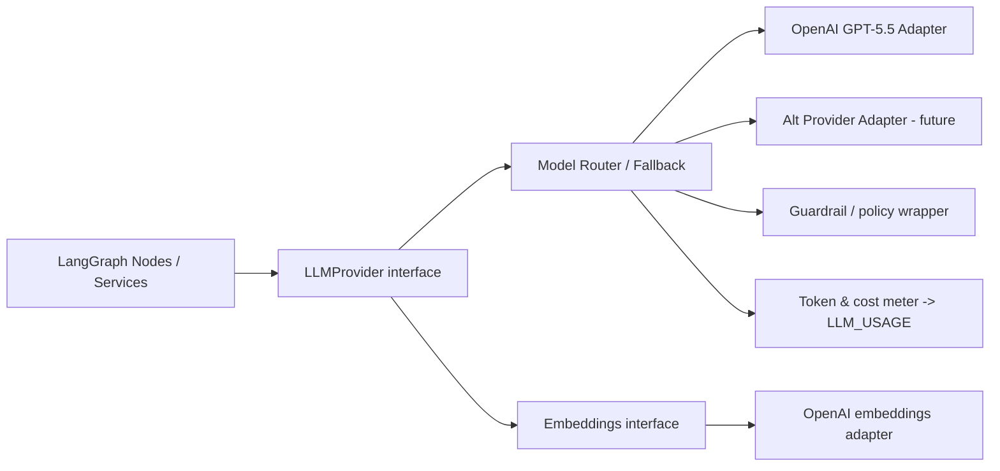

**Interface surface (conceptual, no code):**
- `generate(messages, *, model_tier, temperature, stream, tools) -> Completion | AsyncStream`
- `embed(texts) -> vectors`
- `count_tokens(...)`, `estimate_cost(...)`

**Design properties**
- **Strategy pattern + DI:** the concrete provider is injected; tests use a fake provider (deterministic), enabling unit tests without network.
- **Model routing by tier:** `cheap` (classification), `standard` (drafts), `premium` (complex escalations). Router picks tier per task and can **fallback** to an alternate provider/model on outage.
- **Guardrail wrapper** decorates every call: PII scrubbing on input, policy checks on output, prompt-injection defenses (email content is data, not instructions).
- **Metering wrapper** records tokens/cost per call into `LLM_USAGE` for budgets (§18) and per-tenant billing.
- **Prompt versioning:** prompts live in `ai/prompts/` under version tags; model+prompt version recorded in `CLASSIFICATION.model_version` and `DRAFT_REVISION.model_meta` for reproducibility and A/B evaluation.
- **Open/Closed:** adding a provider = new adapter implementing the interface; nothing upstream changes.

---

## 20. Memory Architecture

A tiered memory model gives the assistant continuity without retraining models.

| Tier | Store | Lifespan | Purpose | Example |
|------|-------|----------|---------|---------|
| **Working memory** | LangGraph state + checkpoint | Single run | In-flight reasoning for one email/draft | current thread context, guardrail verdict |
| **Episodic memory** | `EMAIL_MESSAGE` / `DRAFT_REVISION` / `AGENT_STEP` | Retention window | What happened, decisions made | "Drafted decline to vendor X on Jun 3" |
| **Semantic memory** | `MEMORY_ITEM` (+ `pgvector`) | Long-lived, decaying salience | Learned facts, preferences, relationships | "Prefers concise replies to board members" |
| **Preference memory** | `PREFERENCE`, `VIP_CONTACT` | Explicit/durable | Hard rules & user-set config | "Never auto-reply to legal@" |

### 20.1 Retrieval (RAG for personalization)

On each triage/draft, `retrieve_context` performs hybrid retrieval:
1. **Structured:** thread history, sender's VIP weight, relevant preferences (deterministic).
2. **Semantic:** top-k `MEMORY_ITEM` by vector similarity to the current sender/topic, filtered by `scope` (per-sender, per-topic, global) and re-ranked by `salience` and `last_used_at` (recency).
Retrieved context is injected into the prompt with a strict token budget so cost stays bounded.

### 20.2 Writing & consolidation

- After interactions, `update_memory` proposes new/updated memory items (e.g., inferred tone preference, "this sender always CCs finance").
- **Salience & decay:** items accrue salience when reused and decay over time; low-salience items are periodically pruned by a scheduled consolidation job to prevent unbounded growth and drift.
- **Confidence & provenance:** each memory item records how it was learned (explicit vs inferred). Explicit rules outrank inferred memories on conflict.
- **Transparency & control:** the `/memory` screen lets the executive view, edit, and delete anything the assistant "believes," satisfying trust and privacy requirements. Deletion is honored immediately (right to be forgotten).

### 20.3 Isolation & safety

- Memory is strictly **tenant- and user-scoped**; queries always filter by `user_id`. No cross-tenant leakage is possible at the repository layer.
- Memory content is treated as sensitive (encrypted body handling rules apply where raw text is stored).

---

## Appendix A — Traceability: Requirements → Components

| FR | Realized by |
|----|-------------|
| FR-1, FR-13 | google_oauth, auth routes, settings |
| FR-2 | pubsub webhook, scheduler poll fallback, gmail integration, workers |
| FR-3, FR-4 | triage_graph (classify/prioritize), CLASSIFICATION |
| FR-5 | draft/digest graphs, summarization prompts |
| FR-6, FR-7, FR-8 | draft_graph, DRAFT/DRAFT_REVISION, approval endpoints, guardrails, outbox |
| FR-9, FR-10 | task extraction node, TASK, APScheduler follow-up scan |
| FR-11 | memory_service, MEMORY_ITEM, PREFERENCE, VIP_CONTACT |
| FR-12 | audit_service, AUDIT_EVENT, agent run/step ledger |

## Appendix B — Open Questions / Decisions to Ratify

1. Raw email body retention window (legal/compliance sign-off needed).
2. Default auto-send category allow-list (start empty; expand with evidence).
3. Hosting target for Stage 1 (managed Postgres/Redis provider choice).
4. Whether calendar write access ships in v1.1 or v2.
5. Data-residency requirements for enterprise tenants (drives multi-region timing).

---

*End of document. This SDD is implementation-ready: each module in §4/§5 maps to a buildable unit with defined responsibilities, interfaces, and boundaries. Code (with the type hints, tests, DI, and error handling specified in the engineering contract) follows per-module against these contracts.*
