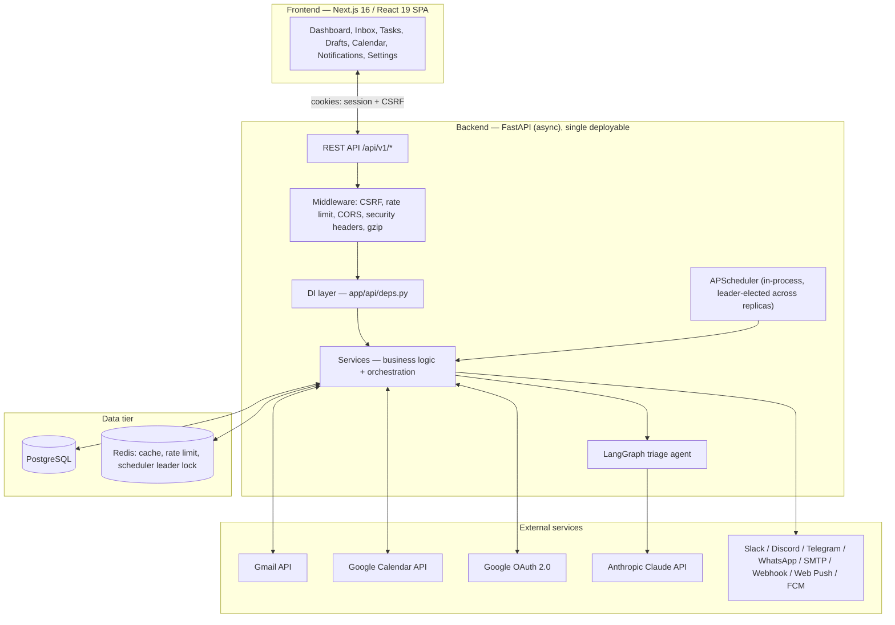
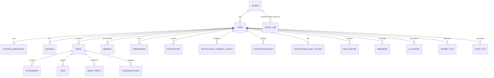
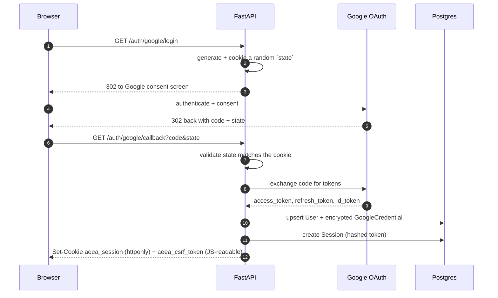
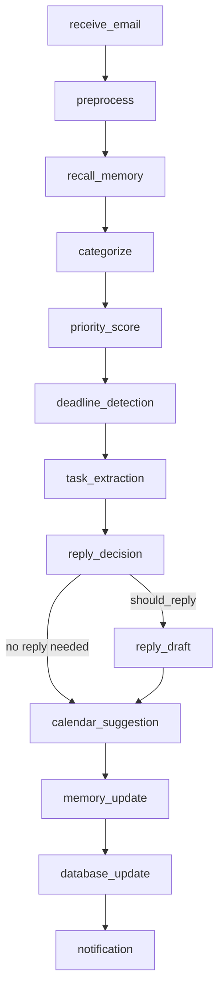

# Architecture

This document describes the AI Executive Email Assistant (AEEA) **as it is actually
built**, not as originally planned — see [`AI_Executive_Email_Assistant_SDD.md`](../AI_Executive_Email_Assistant_SDD.md)
for the original pre-implementation design document, which predates several
decisions below (it specifies OpenAI, WebSocket streaming, Gmail Pub/Sub push,
`pgvector`, and a multi-process worker/scheduler split; the shipped system uses
Anthropic Claude, plain polling REST, no `pgvector`, and a single-process
scheduler — all changes made deliberately during implementation, not drift).

## 1. System overview

AEEA is a **modular-monolith backend** (FastAPI) plus a **Next.js single-page
frontend**, backed by PostgreSQL and Redis. It connects to a user's Gmail
account via OAuth, periodically polls for new mail, runs each email through a
LangGraph-orchestrated AI pipeline (Anthropic Claude) to categorize, prioritize,
extract tasks/deadlines/calendar events, and draft replies, then surfaces all
of that in a dashboard the user reviews and approves from.



## 2. Key architectural decisions

| Decision | Rationale | Trade-off accepted |
|---|---|---|
| **Modular monolith**, not microservices | One team, one bounded context; every request handler, background job, and AI pipeline node run in the same process/deployable | Must scale the whole API horizontally, not per-feature; mitigated by the scheduler's leader-election (below) so this is still safe to scale |
| **Polling**, not Gmail Pub/Sub push | No public webhook endpoint or GCP Pub/Sub subscription to provision/secure; every deployment target (including a laptop behind NAT) works identically | Up to `GMAIL_EMAIL_POLL_INTERVAL_SECONDS` (default 120s) of latency between an email arriving and being ingested |
| **REST + polling on the frontend**, not WebSockets | Simpler client and server; no connection-state management, no separate scaling concern for long-lived connections | The dashboard re-fetches on an interval/on-focus rather than receiving push updates; acceptable for an assistant, not a chat app |
| **Anthropic Claude**, behind a thin internal client | `app/agents/claude_client.py`'s `StructuredLLMClient` wraps the SDK; every prompt/response is logged to `PromptLog` for auditability and cost tracking | Not provider-abstracted behind a swappable interface (single-provider by design, revisit if a second provider is ever needed) |
| **LangGraph** for the triage pipeline | Explicit, inspectable node graph with typed state, rather than a hand-rolled chain of function calls | Team must understand LangGraph's `StateGraph` model |
| **JSON column embeddings**, not `pgvector` | `HashingEmbeddingProvider` computes deterministic local embeddings (no API call, no cost) stored as a plain `JSON` column; semantic search does an in-Python cosine-similarity scan over a bounded candidate pool | Not viable at very large per-user email volumes without revisiting (see §7) |
| **APScheduler in-process**, one leader via Redis lock | No separate broker/worker fleet to operate; `try_acquire_scheduler_leadership` (`app/infra/leader_lock.py`) ensures only one of N horizontally-scaled API replicas actually fires scheduled jobs | All replicas still run the scheduler machinery even though only one fires jobs; negligible overhead |
| **Fernet symmetric encryption** for OAuth tokens, not envelope/KMS encryption | `TokenCipher` (`app/core/crypto.py`) is a single symmetric key from `SECURITY_TOKEN_ENCRYPTION_KEY`; simplest thing that satisfies "tokens are encrypted at rest" | No key rotation/HSM integration; acceptable at current scale, revisit before handling regulated data at volume |
| **Redis fails open** for cache/rate-limit, fails open to *leadership* for the scheduler lock | A Redis outage must never take the whole API down; every Redis-touching path degrades to "uncached"/"unlimited"/"I'm the leader" rather than erroring | A Redis outage on a horizontally-scaled deployment risks duplicate scheduled-job execution until Redis recovers — an accepted, documented trade-off (see `app/infra/leader_lock.py`'s module docstring) |

## 3. Request lifecycle

Every HTTP request passes through this middleware stack (outermost first, as
Starlette actually executes it — see `app/main.py::create_app`):

```
SecurityHeaders → GZip → CORS → RequestLogging → RateLimit → CSRF → routing → handler
```

1. **SecurityHeaders** — sets CSP, `X-Frame-Options`, `X-Content-Type-Options`,
   `Referrer-Policy`, `Permissions-Policy`, and (production only) HSTS on
   every response, including error responses.
2. **GZip** — compresses responses ≥ 1 KB.
3. **CORS** — allow-lists `CORS_ORIGINS`.
4. **RequestLogging** — assigns/propagates `X-Request-ID`, logs method/path/
   status/duration, and records the `aeea_http_requests_total` /
   `aeea_http_request_duration_seconds` Prometheus metrics (labeled by route
   *template*, e.g. `/emails/{id}`, never the raw path, to keep cardinality
   bounded).
5. **RateLimit** — fixed-window limiter keyed by session cookie (or client IP
   if unauthenticated), Redis `INCR`+`EXPIRE`-based with an in-memory
   fallback. `/health/*` and `/metrics` are exempt.
6. **CSRF** — double-submit-cookie check on any mutating request
   (`POST`/`PUT`/`PATCH`/`DELETE`) that carries a session cookie.
7. **Routing → dependency injection → handler** — FastAPI resolves the route,
   then its declared dependencies (`app/api/deps.py`): current user (from the
   session cookie, looked up via `SessionRepository`), a scoped SQLAlchemy
   `AsyncSession`, and whichever service classes the handler needs.
8. **Response** — Pydantic response models serialize the result; any raised
   `AppError` subclass (or FastAPI validation error) is caught by the
   handlers in `app/api/errors.py` and rendered as RFC 9457
   `application/problem+json`.

## 4. Data model

PostgreSQL, multi-tenant from the schema up: every domain table carries a
`tenant_id`, and every repository query filters by it — there is no
cross-tenant query path. Alembic manages migrations (`backend/migrations/`).

Core entities and their relationships:



Every table also has a matching Pydantic schema (`app/schemas/`), repository
(`app/infra/repositories/`), and — for anything exposed over the API — a
FastAPI route module (`app/api/v1/routes/`). A handful of `schemas`/`services`
pairs (`ai_history`, `attachment`, `audit_log`, `label`, `memory` (the
standalone schema, not `app/services/memory.py`, which *is* live), `prompt_log`,
`summary`) exist as complete implementations that were never wired to a route
— see the [Developer Guide](DEVELOPER_GUIDE.md#8-known-gaps) for the full list
and what to do about them.

## 5. Authentication & session model

Two distinct token types, never conflated:

1. **First-party session** — after Google OAuth completes, the backend issues
   its own opaque session token, stored `httponly`+`secure` (in production)
   in the `aeea_session` cookie, and hashed (SHA-256) before being persisted
   to the `sessions` table — the raw token is never stored server-side, only
   compared by hash.
2. **Google OAuth tokens** — the Gmail/Calendar access + refresh tokens are
   Fernet-encrypted (`TokenCipher`) and stored in `google_credentials`;
   `GoogleAuthService.get_valid_access_token` transparently refreshes the
   access token ~120 seconds before expiry, and raises
   `ReauthenticationRequiredError` if Google reports the refresh token itself
   has been revoked (user must sign in again).

CSRF: on successful login, the backend also sets a **JS-readable**
`aeea_csrf_token` cookie alongside the `httponly` session cookie. The
frontend reads it and echoes it back as an `X-CSRF-Token` header on every
mutating request (see `frontend/src/lib/auth.tsx` and the `logged_in_client`
test fixture for both sides of this contract) — the double-submit-cookie
pattern, which needs no server-side CSRF-token storage.



## 6. The AI email-triage pipeline

Every newly ingested email runs through a 13-node LangGraph
(`app/agents/graph.py::build_email_triage_graph`), with typed state
(`EmailTriageState`) threaded through every node:



- **`recall_memory`** — retrieves the user's relevant long-term `Memory`
  items (see §7) to personalize categorization/tone.
- **`categorize`** / **`priority_score`** / **`deadline_detection`** /
  **`task_extraction`** — each one Claude call (via `StructuredLLMClient`,
  which validates the response against a Pydantic schema and retries on a
  malformed response), producing a category (`action_required`,
  `meeting_request`, `fyi`, `newsletter`, `personal`, `spam`, `other`), a
  0–1 urgency score, an optional extracted deadline, and zero or more tasks.
- **`reply_decision`** / **`reply_draft`** — decides whether a reply is
  warranted and, if so, drafts one in the configured tone — **never sent
  automatically**; it's stored as a `DraftReply` in `pending` status for the
  user to review, edit, approve, or discard from the UI.
- **`calendar_suggestion`** — proposes a `CalendarEvent` if the email implies
  a meeting.
- **`memory_update`** — writes back anything worth remembering long-term.
- **`database_update`** — the only node that persists everything atomically;
  every prior node's output is pure state until this point.
- **`notification`** — fans out an in-app + external-channel notification if
  a draft was created or the email is high-priority.

Every node's failure is isolated — one bad email never blocks the batch (see
`app/scheduler.py::backfill_email_embeddings` and
`process_retry_queue`/`dispatch_due_reminders` for the same pattern applied
to background jobs) — and a failed triage run is pushed onto the generic
retry queue (`FailedJob`, `job_type="ai_triage"`) for automatic retry with
backoff, eventually dead-lettering after `max_attempts`.

## 7. Memory & search

- **`Memory`** rows are per-user, per-`memory_type` (`fact`, `preference`,
  `relationship`, ...), each with a deterministic local embedding
  (`HashingEmbeddingProvider`, `app/agents/embeddings.py` — no external API
  call) and an `importance_score` that **decays** over time
  (`run_memory_decay_sweep`, a daily scheduled job) unless reinforced by
  reuse.
- When a user's memory count for a given type crosses
  `MEMORY_SUMMARIZATION_THRESHOLD`, `MemoryService.maybe_summarize`
  consolidates the low-signal items into fewer, higher-quality ones via
  Claude (`run_memory_consolidation`, also scheduled).
- **Email semantic search** (`app/services/email_search.py`) combines a
  structured filter (category, date range, read/starred) with the same local
  embedding + cosine-similarity ranking over the candidate pool —
  `backfill_email_embeddings` (scheduled) fills in embeddings for any email
  that doesn't have one yet, one bounded batch per run.

## 8. Background jobs

All of it runs via a single `AsyncIOScheduler` (`app/scheduler.py::build_scheduler`),
started only on the Redis-elected leader replica:

| Job | Cadence | Purpose |
|---|---|---|
| `poll_gmail` | every `GMAIL_EMAIL_POLL_INTERVAL_SECONDS` (120s) | Ingest new mail (the Pub/Sub-less polling fallback that's actually the only ingestion path) |
| `dispatch_due_reminders` | every `SCHEDULER_REMINDER_POLL_INTERVAL_SECONDS` (60s) | Turn due reminders into notifications |
| `sync_google_calendars` | every `SCHEDULER_CALENDAR_SYNC_INTERVAL_SECONDS` (300s) | Push pending calendar events to Google Calendar |
| `run_memory_decay_sweep` | every `SCHEDULER_MEMORY_DECAY_INTERVAL_HOURS` (24h) | Recompute every memory's importance score |
| `run_memory_consolidation` | every `SCHEDULER_MEMORY_CONSOLIDATION_INTERVAL_HOURS` (24h) | Summarize low-signal memories per user/type |
| `send_morning_digests` / `send_weekly_digests` | daily / weekly, cron | Build and notify the day's/week's recap |
| `run_cleanup_sweep` | every `SCHEDULER_CLEANUP_INTERVAL_HOURS` (24h) | Purge expired sessions, old prompt logs, resolved notifications/retry jobs past retention |
| `process_retry_queue` | every `SCHEDULER_RETRY_QUEUE_INTERVAL_SECONDS` (60s) | Drain due `FailedJob` rows, dispatched by `job_type` back to the operation that failed |
| `run_health_check_sweep` | every `SCHEDULER_HEALTH_CHECK_INTERVAL_SECONDS` (120s) | Continuous self-check (DB, queue depths) feeding `aeea_health_check_status` |
| `backfill_email_embeddings` | every `SCHEDULER_EMAIL_EMBEDDING_BACKFILL_INTERVAL_SECONDS` (300s) | Fill in missing embeddings, one bounded batch per run |

Every job body is wrapped in `track_job(...)` (duration + success/failure
Prometheus metrics) and its own top-level try/except — one job failing never
stops the scheduler or any other job.

## 9. Notifications

`NotificationDispatchService` (`app/services/notification_dispatch.py`) fans
a `Notification` out to every channel the user has enabled
(`NotificationChannelConfig`), gated by their `NotificationRule`s and
`NotificationQuietHours` (with an urgent-notification override). Supported
channels: in-app, Slack, Discord, Telegram, WhatsApp (Twilio), email (SMTP),
generic webhook (HMAC-signed if a secret is configured), desktop Web Push
(VAPID), and mobile push (Firebase Cloud Messaging). Each channel's config is
Fernet-encrypted at rest; a failed delivery enqueues a `FailedJob`
(`job_type="notification_delivery"`) for automatic retry.

## 10. Caching, rate limiting, and Redis

Redis serves three independent purposes, and every one of them **fails
open** on a Redis outage (see `app/infra/cache.py`'s module docstring) except
the scheduler leader lock, which fails open to *leadership* (the opposite
direction — see §2's trade-off table):

1. **Response caching** (`app/api/cache_utils.py`) — the dashboard summary and
   every analytics widget are cached per-user (and per-parameter-set) for
   `REDIS_DEFAULT_TTL_SECONDS`, via a generic `cached()` helper built on
   Pydantic `TypeAdapter` for JSON round-tripping.
2. **Rate limiting** — see §3.
3. **Scheduler leader election** — see §2 and §8.

## 11. Observability

- **Structured JSON logs** (`structlog`), every entry carrying
  `request_id`/trace context where applicable.
- **Prometheus metrics** at `/api/v1/metrics`: HTTP request rate/duration
  (by route template), job run outcomes/duration, cache hit/miss, rate-limit
  rejections, AI-triage outcomes, retry-queue/dead-letter-queue depth,
  health-check status — scraped by the bundled Prometheus, visualized in the
  bundled Grafana dashboard (`infra/grafana/`).
- **Sentry** (error tracking) and **OpenTelemetry** (distributed tracing,
  including SQLAlchemy/httpx/FastAPI auto-instrumentation) are both fully
  opt-in — no-ops unless `SENTRY_DSN` / `OTEL_EXPORTER_OTLP_ENDPOINT` are
  set, and every setup call is defensively wrapped so a third-party SDK
  issue can never crash startup.
- **Health checks**: `/health/live` (process is up), `/health/ready`
  (database — and informationally Redis — reachable; only the database
  gates the 503).

## 12. Security

- **RFC 9457** `application/problem+json` for every error response, with a
  stable machine-readable `code` (see the [API description](../backend/app/openapi_metadata.py)
  for the full catalog) and never a leaked stack trace.
- **CSRF**: double-submit cookie, described in §5.
- **Security headers**: CSP (`default-src 'none'`, since this is a pure JSON
  API), `X-Frame-Options: DENY`, `X-Content-Type-Options`,
  `Referrer-Policy`, `Permissions-Policy`, HSTS in production.
- **SQL injection**: eliminated by construction — every query goes through
  SQLAlchemy's Core/ORM query builder (parameterized), never raw string
  interpolation.
- **XSS**: the API returns only `application/json`; the frontend is a React
  SPA (auto-escaping by default) that never uses `dangerouslySetInnerHTML`
  on untrusted email content.
- **Secrets**: never logged (a redaction convention is followed throughout,
  e.g. `password: str = ""  # noqa: S105` markers on intentionally-empty
  defaults); Fernet keys/DB passwords/API keys come from environment
  variables, never hardcoded; `Settings` refuses to boot with
  `ENVIRONMENT=production` if any insecure default (public Fernet key,
  non-secure session cookie, wildcard CORS, unconfigured OAuth) is still
  active — see `Settings._reject_insecure_production_config`.
- **Least-privilege Google scopes**: `gmail.readonly` + `gmail.labels` +
  Calendar scopes only — never `gmail.send`, since the assistant never sends
  email on the user's behalf (drafts are stored locally and reviewed, not
  pushed to Gmail as sendable drafts either, in the current implementation).

## 13. Frontend

Next.js 16 (App Router) + React 19.2, entirely client-rendered
(`"use client"` throughout — no server components in the data-fetching path,
since every page needs the session cookie). `src/lib/api.ts` is a thin typed
`fetch` wrapper (credentials included, CSRF header attached by the caller —
see `src/lib/auth.tsx`) that throws a typed `ApiError` on any non-2xx
response, parsed from the backend's RFC 9457 body. `AuthGate` gates the
entire dashboard behind a real `GET /auth/me` check — there is no
client-side-only auth state. `useAsync` (a small custom hook, not a data-
fetching library) standardizes loading/error/data/refetch across every page.

## 14. Testing strategy

- **Backend**: `pytest` against a fresh SQLite-backed database per test,
  with real in-process fake doubles for every third-party service
  (`tests/fake_google`, `tests/fake_anthropic`, `tests/fake_redis`) instead
  of `unittest.mock` — real HTTP request/response cycles through real ASGI
  apps, not stubs standing in for this codebase's own logic. A separate CI
  job (`docker-smoke-test`) boots the real Docker Compose stack (real
  Postgres, real Redis) specifically to catch dialect-specific bugs the
  SQLite-backed suite structurally cannot see.
- **Frontend**: Vitest + React Testing Library, same real-boundary
  philosophy (mocking only the true external boundary — `fetch`, or a
  third-party library call with no injectable transport — never this
  codebase's own components/hooks).
- **Load**: Locust (`backend/tests/load/`), targeting the cached/rate-limited
  endpoints specifically, to validate Phase 14's productionization work
  under concurrency, not just correctness.

See the [Developer Guide](DEVELOPER_GUIDE.md) for how to run all of the above.

## 15. Deployment topology

See the [Deployment Guide](DEPLOYMENT.md) for the full reference; in brief,
every deployable is a single Docker image (multi-stage build,
`backend/Dockerfile`), horizontally scalable behind a load balancer, with
exactly one scheduler leader elected via Redis at any time — see §2 and §8.
